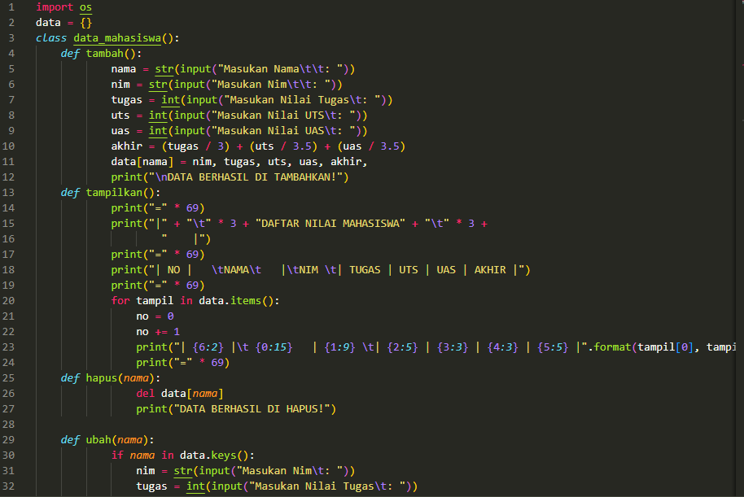
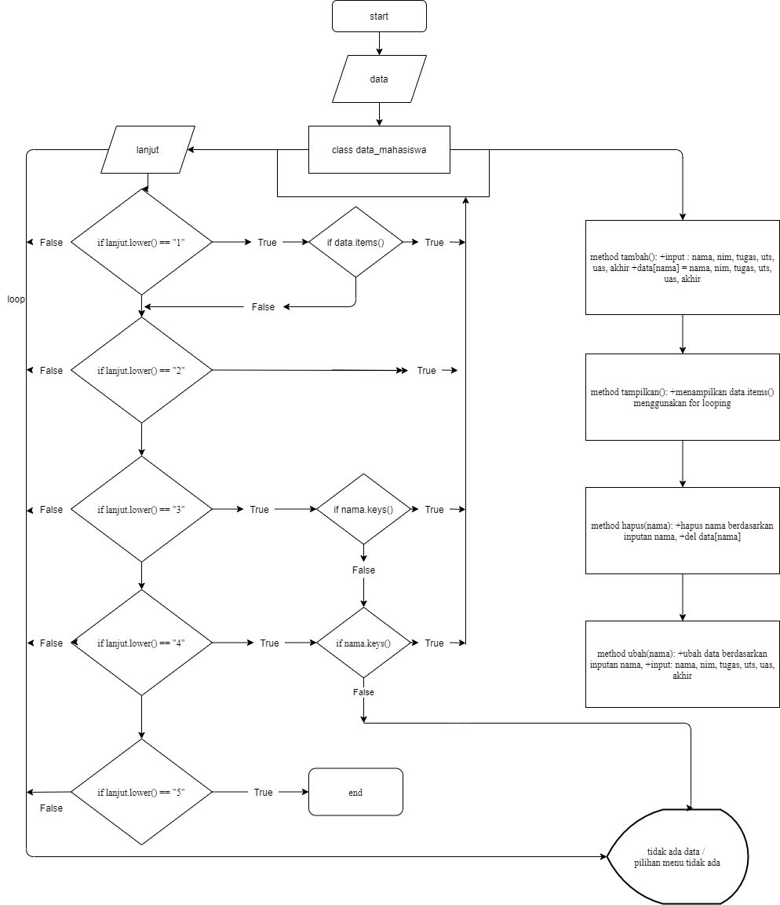

# praktikum7
# Tugas Praktikum

> Buat program sederhana dengan mengaplikasikan penggunaan class. Buatlah class untuk menampilkan daftar nilai mahasiswa, dengan ketentuan:
- Method tambah() untuk menambah data
- Method tampilkan() untuk menampilkan data
- Method hapus(nama) untuk menghapus data berdasarkan nama
- Method ubah(nama) untuk mengubah data berdasarkan nama
 
 # penjelasan 
 PENJELASAN PROGRAM
1. deklarasi dictionary dengan data untuk menampung semua data Mahasiswa.
2. Tambah fungsi def tambah() di isi dengan inputan nama, nim, tugas, uts, uas dan total nilai akhir
untuk dan di masukan ke data Mahasiswa.
3. Tambah fungsi def tampilkan() di isi dengan cetak isi dari dictonary.
4. Tambah fungsi def hapus(nama) di isi dengan program untuk menghapus element nama pada data Mahasiswa.
5. gunakan fungsi def ubah(nama) di isi dengan inputan nama dan mengubah isi element pada nama tersebut.
7. gunakan while True untuk menlooping/mengulang statment.
8. gunakan statment if, elif, else, di dalam while True dan panggil fungsi dari masing masing fungsi, contoh:
- tambah()
- tampilkan()
- hapus(nama)
- ubah(nama)
9. selesai

# PROGRAM

.png)
.png)

# FLOWCHART

# OUTPUT PROGRAM 
.png)
.png)
